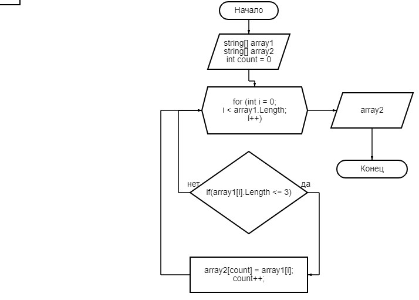

## Описание алгоритма:
Берем два массива, первоначальный и новый такой же длины. Потом используем метод, в котором запускаем цикл с проверкой. Берем переменную count, в которую присваивается подходящее значение из первого массива. После присвоения увеличиваем переменную count на 1, а в цикле увеличиваем индекс на 1. Получаем новый массив.

 ## Блок-схема
 